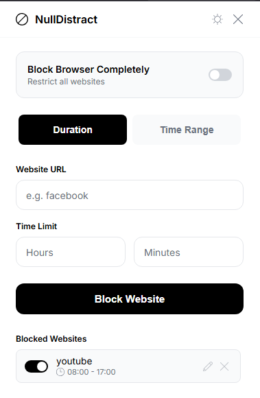
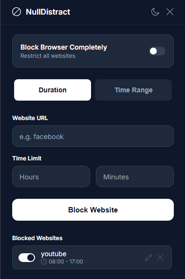

# NullDistract

NullDistract is a lightweight, privacy-minded website blocker built for developers and power users. It prioritizes performance, minimal data collection, and an environment free from interruptions — set your distractions to null.

---

## Key Features

- **Global Lock:** Temporarily lock browsing across all tabs with a single action to create an uninterrupted focus period.
- **Session Timer:** Allow limited time on specific sites (e.g., 30 minutes on YouTube). After the timer expires, access is automatically blocked.
- **Scheduled Focus Windows:** Define recurring focus periods (for example, 09:00–17:00) during which selected URLs are blocked.
- **Performance-First Blocking:** Uses Chrome's `declarativeNetRequest` API for efficient, low-overhead request filtering.
- **Minimal UI:** Clean dark-mode interface designed to surface only the controls you need.

---

## Screenshots

| Light Mode | Dark Mode |
| :---: | :---: |
|  |  |

---

## Installation (Local / Developer)

To load the extension locally while it's under development:

1. Download or clone the project repository to your machine.
2. Open Chrome and navigate to `chrome://extensions/`.
3. Enable **Developer mode** (toggle in the top-right corner).
4. Click **Load unpacked** and select the project folder containing `manifest.json`.
5. The extension will appear in the extensions list — pin it to the toolbar if desired.

---

## Project Structure

```
NullDistract/
├── assets/             # SVGs and image assets
├── js/
│   ├── background.js   # Core logic & alarm management
│   ├── blocking.js     # Chrome API wrapper (rule management)
│   ├── storage.js      # Data persistence (Chrome storage)
│   └── utils.js        # Utility functions (time calculations)
├── popup.html          # Extension UI
├── style.css           # Styling and theme variables
└── manifest.json       # Extension configuration (Manifest V3)
```

## Tech Stack

- Frontend: HTML5, CSS3 (custom properties for theme support), Vanilla JavaScript (ES6+).
- Platform: Chrome Extensions (Manifest V3).
- Blocking Engine: `declarativeNetRequest` for efficient request filtering.

---

## License & Contribution

This project is provided for personal use and experimentation. Contributions and forks are welcome — please open issues or pull requests if you'd like to contribute or suggest improvements.

---

If you find NullDistract useful, please consider leaving a star or a like — it really helps. Thank you for your support!

